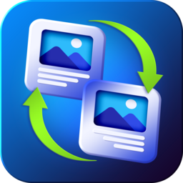
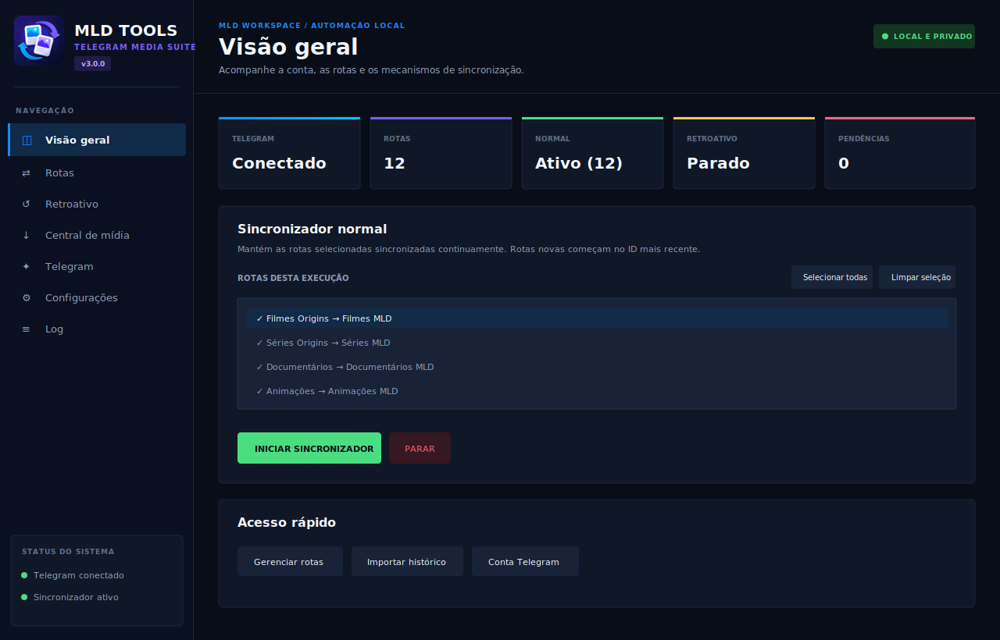

# MLD Tools



**Telegram Media Suite para sincronizar, baixar, exportar e enviar conteúdo no Windows.**

O MLD Tools copia mensagens entre conversas às quais a sua conta tem acesso. O conteúdo chega ao destino como uma nova publicação, sem a assinatura “Encaminhada de”.

A versão 3.0 também incorpora as ferramentas do TDL em uma **Central de mídia** separada, aberta diretamente pela interface principal.



A interface da v3 usa um sistema visual único no painel principal e na Central
de mídia: sidebar contextual, cabeçalhos por tarefa, cards de estado e a paleta
navy, azul e violeta derivada do ícone oficial. Superfícies, badges, navegação
e ações usam CustomTkinter para exibir cantos arredondados reais e manter uma
escala legível no Windows.

## Recursos

- sincronização contínua de mensagens novas;
- seleção de uma, várias ou todas as rotas no modo normal;
- importação retroativa de mensagens antigas;
- múltiplas rotas independentes;
- canal, grupo ou tópico na origem e no destino;
- seleção de canais e grupos pelo nome ao criar ou editar rotas;
- busca de tópicos diretamente pela interface;
- suporte a textos, fotos, vídeos, documentos, legendas e álbuns;
- modo opcional de baixar e reenviar arquivos quando a origem bloqueia o encaminhamento;
- pasta temporária configurável, limite de uso e pré-verificação de álbuns;
- preservação de formatações compatíveis do Telegram;
- tratamento seguro de legendas longas e prévias de links;
- progresso salvo para continuar de onde parou;
- downloads por links de mensagens, JSON, canal, grupo ou tópico;
- fila unificada de downloads e uploads com início manual, pausa e retomada;
- atividade recente e histórico persistente para downloads e uploads;
- exportação de mensagens, membros e inscritos para JSON;
- upload de arquivos e pastas para conversas, canais, grupos e tópicos;
- upload agrupado em álbuns por seleção ou por pasta;
- versão portátil e instalador para Windows.

## Download

Baixe a versão mais recente na página de [Releases](../../releases/latest).

| Opção | Indicação |
|---|---|
| `MLDTools_Setup_v3.0.0.exe` | Instalação comum no Windows, com atalhos e desinstalador. |
| `MLDTools_Portable.zip` | Uso sem instalação. Extraia o ZIP antes de executar. |

> O projeto ainda não possui assinatura digital. O Windows SmartScreen pode exibir um aviso de editor desconhecido. Confira se o arquivo veio desta página e valide o SHA-256 publicado na Release.

## Requisitos

- Windows 10 ou Windows 11 de 64 bits;
- conta ativa do Telegram;
- acesso de leitura às origens configuradas;
- permissão para publicar nos destinos;
- API ID e API Hash obtidos em [my.telegram.org](https://my.telegram.org/).

O usuário da versão compilada não precisa instalar Python.

## Primeiros passos

1. Instale o programa ou extraia a versão portátil.
2. Abra `MLDTools.exe`.
3. Entre em **Telegram** e informe seu API ID e API Hash.
4. Autentique sua conta com telefone, código e senha 2FA, quando solicitada.
5. Entre em **Rotas** e cadastre uma origem e um destino.
6. Use o **Dashboard** para iniciar a sincronização normal.
7. Use **Retroativo** somente quando quiser importar mensagens antigas.
8. Abra **Central de mídia** para downloads, exportações, uploads e fila.

O passo a passo completo está no [Guia do Usuário](docs/GUIA_DO_USUARIO.md).

## Central de mídia

A Central de mídia é executada em uma janela independente para que downloads e uploads não bloqueiem a interface do sincronizador. Ela inclui:

- **Novo download:** recebe links, exportações JSON ou uma conversa selecionada pelo nome;
- **Central de exportação:** exporta mensagens ou membros com filtros e intervalos;
- **Upload para Telegram:** adiciona arquivos ou pastas, escolhe canal, grupo ou tópico e envia a tarefa para a fila;
- **Fila e histórico:** ordena downloads e uploads juntos e permite iniciar, pausar, retomar, cancelar ou repetir tarefas.

O motor `tdl` possui autenticação própria dentro da Central de mídia e é usado para downloads, exportações e uploads comuns. Para **upload em álbuns**, o MLD Tools utiliza a sessão autenticada na tela principal **Telegram**. Recomenda-se conectar a mesma conta nos dois motores.

Em **Novo download**, a opção **Manter nome original** remove os IDs adicionados pelo `tdl` e conserva o nome do arquivo enviado ao Telegram. Para coleções que possam conter nomes repetidos, mantenha a opção desmarcada para usar os IDs como proteção contra colisões.

Ao marcar **Enviar arquivos agrupados em álbuns**, escolha entre **Seleção atual** ou **Cada pasta**. Os arquivos são ordenados naturalmente e seleções maiores são divididas automaticamente em vários álbuns. A legenda é aplicada ao primeiro arquivo de cada álbum.

O botão **Adicionar à fila** não inicia o envio. Downloads e uploads permanecem aguardando até o comando **Iniciar fila** e são processados na ordem em que foram criados. O botão **Cancelar** fica na página da fila e não modifica os arquivos locais; itens já publicados permanecem no Telegram.

Uploads não possuem retomada real pelo Telegram. Uma tarefa pausada reinicia do começo quando continuada; arquivos ou álbuns já publicados podem ser duplicados. O MLD Tools exibe esse aviso antes de pausar um upload ativo.

Uploads comuns e downloads usam os parâmetros de desempenho do `tdl`. Em **Configurações > Desempenho e rede**, estão disponíveis os perfis **Equilibrado** (`8/4/8`), **Rápido** (`16/6/12`) e **Agressivo** (`24/8/16`). O Rápido é a recomendação geral; o Agressivo é destinado a testes com SSD, conexão rápida e conta Premium. Valores maiores não eliminam os limites do Telegram e podem causar esperas temporárias.

No envio de documentos agrupados em álbuns, o MLD Tools usa criptografia nativa acelerada e faz o pré-upload simultâneo de até quatro arquivos, mantendo a ordem original na publicação. Fotos continuam no fluxo próprio do Telethon para preservar o redimensionamento e o formato de foto.

## Formatação preservada

A versão 3.0.0 preserva, quando suportados pelo Telegram:

- negrito, itálico, sublinhado e tachado;
- spoiler e código;
- links, menções e citações;
- emojis personalizados compatíveis;
- formatação individual das legendas de álbuns.

Quando uma legenda excede o limite aceito pela conta, a mídia é enviada primeiro e o texto completo aparece logo depois, com sua formatação preservada. Mensagens com links também recriam a prévia da página no destino.

## Baixar e reenviar arquivos

Cada rota pode ativar a opção **Baixar e reenviar arquivos**. Ela foi criada para origens que permitem o download, mas bloqueiam o encaminhamento ou a cópia direta da mídia.

Nesse modo, o MLD Tools:

1. baixa o arquivo para a subpasta administrada `temp_transferencias`;
2. retoma um download parcial quando encontra um arquivo `.part`;
3. envia a mídia como um novo arquivo, sem assinatura de encaminhamento;
4. apaga o temporário somente após a confirmação do envio.

O download e o upload mantêm até quatro partes de 512 KB em voo para reduzir as esperas entre requisições. Em álbuns, esse limite é compartilhado por todos os arquivos: as transferências podem avançar juntas, mas a publicação final conserva a ordem original. O `cryptg` acelera a criptografia usada pelos motores compilados.

O arquivo completo é mantido quando o upload falha, evitando um novo download na próxima tentativa. Arquivos acima de 2 GB exigem Telegram Premium na conta conectada para poderem ser reenviados; o limite Premium é de 4 GB.

Em **Configurações > Armazenamento temporário**, é possível escolher a pasta-pai, consultar o espaço livre, definir um limite em GB e limpar temporários quando os sincronizadores estiverem parados. Antes de baixar um álbum, o programa soma todos os tamanhos conhecidos e cancela a operação inteira se o espaço ou o limite configurado não forem suficientes.

O modo fica desativado nas rotas antigas e deve ser habilitado manualmente apenas onde for necessário, pois utiliza espaço em disco e consome download e upload.

## Seleção de rotas no modo normal

No **Dashboard**, marque uma, várias ou todas as rotas antes de iniciar o sincronizador normal. A seleção vale somente para aquela execução e não altera as rotas cadastradas, seus progressos ou o modo de transferência configurado em cada uma. Por compatibilidade, todas as rotas começam selecionadas.

## Dados locais e segurança

As credenciais e a sessão são armazenadas localmente na pasta do programa. O MLD Tools não possui servidor próprio para receber esses dados.

Nunca compartilhe:

- `.env`;
- `*.session` ou `*.session-journal`;
- configurações contendo IDs que você prefira manter privados;
- logs e arquivos de progresso com informações pessoais.

Os modelos incluídos no repositório não contêm credenciais ou rotas reais.

## Compilando pelo código-fonte

Requisitos de build:

- Windows;
- Python 3.12;
- Inno Setup 6 ou 7, caso queira gerar o instalador.

Para gerar os executáveis e o pacote portátil:

```bat
build_exe.bat
```

Para gerar executáveis, portátil e instalador:

```bat
build_release.bat
```

Consulte também `README_BUILD.txt` e `README_INSTALLER.txt`.

## Limitações atuais

- o computador e o MLD Tools precisam permanecer ligados durante a sincronização;
- edições e exclusões posteriores na origem não alteram a cópia já publicada;
- rotas novas começam nas mensagens mais recentes; use o modo retroativo para o histórico;
- o modo de download e reenvio depende de a conta conseguir baixar a mídia pela API do Telegram;
- a velocidade final ainda depende da conexão, do datacenter e dos limites aplicados pelo Telegram;
- limites e bloqueios temporários aplicados pelo Telegram continuam valendo.

## Uso responsável

Use o programa somente em canais e grupos aos quais você tem acesso. Respeite permissões, direitos autorais, privacidade e os Termos de Serviço do Telegram. O MLD Tools não deve ser usado para spam.

MLD Tools é um projeto independente e não possui vínculo, patrocínio ou aprovação oficial do Telegram.

## Licença

O projeto é distribuído sob a licença descrita em [LICENSE](LICENSE). O código pode ser consultado para auditoria, mas redistribuição, modificação, reempacotamento e comercialização exigem autorização prévia do autor.
