# MLDForwarder 2.8.0 — Guia completo do usuário

## Sincronize canais, grupos e tópicos do Telegram sem assinatura de encaminhamento

O **MLDForwarder** é uma ferramenta para Windows que copia mensagens entre canais e grupos do Telegram usando a sua própria conta. As mensagens chegam ao destino como novas publicações, sem a indicação “Encaminhada de”.

O programa suporta textos, fotos, vídeos, documentos, legendas e álbuns. A versão 2.8.0 também preserva as formatações compatíveis do Telegram, incluindo negrito, itálico, sublinhado, tachado, spoiler, código, links, menções, citações e emojis personalizados compatíveis.

Também é possível criar várias rotas, usar tópicos tanto na origem quanto no destino e importar mensagens antigas. Em álbuns, a formatação de cada legenda é tratada separadamente.

Com ele, você pode criar rotas como canal → canal, canal → grupo, canal → tópico, grupo → grupo, grupo → tópico e tópico → tópico.

Este guia foi preparado para o **MLDForwarder 2.8.0**.

> Use o programa apenas em canais e grupos aos quais você tem acesso e respeite as regras e os Termos de Serviço do Telegram. O MLDForwarder não é uma ferramenta de spam.

---

## 1. Antes de começar

Você precisará de:

- Windows 10 ou Windows 11;
- uma conta ativa do Telegram;
- acesso de leitura ao canal ou grupo de origem;
- permissão para publicar no canal, grupo ou tópico de destino;
- um **API ID** e um **API Hash** próprios do Telegram.

Não é necessário instalar Python.

> A conta conectada ao MLDForwarder precisa conseguir visualizar a origem e publicar no destino. Se a conta não tiver essas permissões, a sincronização não poderá ser concluída.

---

## 2. Instalando ou usando a versão portátil

### Versão com instalador

1. Baixe o arquivo `MLDForwarder_Setup_v2.8.0.exe`.
2. Abra o instalador e siga as instruções exibidas.
3. Depois da instalação, abra o MLDForwarder pelo atalho criado no Windows.

### Versão portátil

1. Baixe o arquivo `MLDForwarder_Portable.zip`.
2. Clique com o botão direito sobre o ZIP e selecione **Extrair tudo**.
3. Abra a pasta extraída.
4. Execute `MLDForwarder.exe`.

Não execute o programa diretamente de dentro do ZIP. Os três executáveis abaixo devem permanecer juntos na mesma pasta:

- `MLDForwarder.exe` — interface gráfica;
- `MLDForwarderSync.exe` — sincronização contínua;
- `MLDForwarderRetro.exe` — importação retroativa.

Você não precisa abrir os dois motores manualmente. O `MLDForwarder.exe` inicia cada um quando necessário.

> A versão 2.8.0 ainda não possui assinatura digital. Por isso, o Windows pode exibir um aviso do SmartScreen. Se o arquivo veio da fonte oficial do projeto, clique em **Mais informações** e depois em **Executar assim mesmo**.

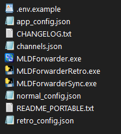

---

## 3. Criando suas credenciais do Telegram

O Telegram exige que cada usuário crie suas próprias credenciais de API. Elas identificam a aplicação usada para conectar a conta.

1. Abra o MLDForwarder.
2. No menu lateral, entre em **Telegram**.
3. Clique em **Obter API ID e API Hash em my.telegram.org ↗**.
4. Informe seu número com código do país. No Brasil, use o formato `+55 DDD NÚMERO`.
5. O Telegram enviará um código de confirmação pelo próprio aplicativo, e não por SMS.
6. Depois de entrar no portal, abra **API development tools**.
7. Preencha o formulário de criação da aplicação.
8. Copie os valores de **api_id** e **api_hash** apresentados.

Cada número do Telegram pode ter somente um API ID associado no portal. Guarde essas credenciais em segurança.

Link direto: https://my.telegram.org/

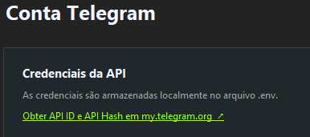

---

## 4. Salvando as credenciais no MLDForwarder

Na página **Telegram**, preencha:

### API ID

O número fornecido pelo portal do Telegram.

### API Hash

O código secreto exibido junto do API ID.

### Nome da sessão

Nome do arquivo usado para manter sua conta conectada. O padrão é `user_session` e normalmente não precisa ser alterado.

Clique em **SALVAR CREDENCIAIS**.

As informações ficam armazenadas localmente na pasta do programa. Elas não são enviadas para um servidor do MLDForwarder.

> Nunca publique seu API Hash, o arquivo `.env` ou o arquivo `user_session.session`.

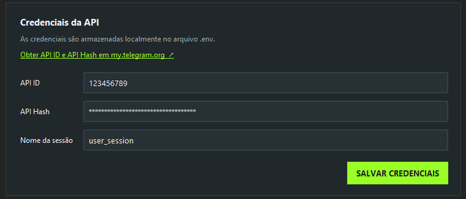

---

## 5. Conectando sua conta

Ainda na página **Telegram**:

1. Digite seu número no campo **Telefone**, incluindo `+55` e o DDD.
2. Clique em **Enviar código**.
3. Abra o Telegram e localize o código recebido.
4. Digite-o no campo **Código recebido**.
5. Clique em **Confirmar código**.

Se a conta usa verificação em duas etapas, o MLDForwarder mostrará **Senha 2FA necessária**. Digite a senha no campo **Senha 2FA** e clique em **Confirmar senha**.

Quando a autenticação terminar, o status mudará para conectado. O botão **Verificar sessão** pode ser usado a qualquer momento para confirmar se a sessão ainda é válida.

O botão **Sair da conta** encerra a sessão local. Na próxima utilização, será necessário autenticar novamente.

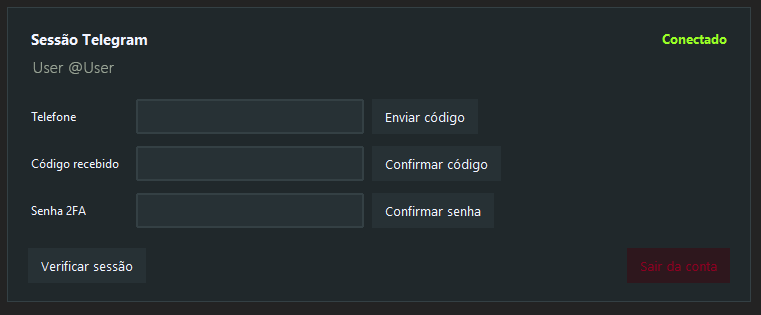

---

## 6. Conhecendo a interface

O menu lateral possui seis áreas:

### Dashboard

Mostra o estado do Telegram, a quantidade de rotas, os processos normal e retroativo e o número de pendências. É também onde você inicia ou interrompe a sincronização contínua.

### Rotas

Gerencia as ligações entre origens e destinos. Uma rota informa ao programa de onde copiar e para onde enviar.

### Retroativo

Importa mensagens antigas de uma rota específica ou de todas as rotas.

### Telegram

Guarda as credenciais e controla a autenticação da conta.

### Configurações

Define o tamanho dos lotes e o intervalo da sincronização normal.

### Log

Exibe o que o programa está fazendo, incluindo mensagens processadas, pausas, avisos e erros.

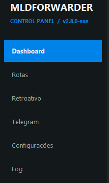

---

## 7. Criando uma rota

1. Entre em **Rotas**.
2. Clique em **+ Adicionar**.
3. Preencha os campos da nova rota.

### Canal ou grupo de origem

É o local de onde as mensagens serão copiadas. Informe o ID numérico ou o `@username` acessível pela conta conectada.

Exemplo de ID:

`-1001234567890`

### ID do tópico de origem — opcional

Use este campo quando quiser sincronizar somente um tópico de um grupo com fórum ativado.

Deixe vazio para sincronizar o canal ou grupo inteiro.

### Canal ou grupo de destino

É o local que receberá as novas mensagens. Informe o ID numérico ou o `@username`. A conta conectada precisa ter permissão para publicar nele.

### ID do tópico de destino — opcional

Use este campo quando as mensagens precisarem ser publicadas dentro de um tópico específico do grupo de destino.

Deixe vazio para enviar ao canal, grupo ou tópico principal.

### Nome da rota

Um nome de identificação exibido na interface, como:

- Filmes → Backup;
- Novidades → Arquivo;
- Tópico Dublagens → Canal Dublagens;
- Canal Filmes → Tópico Lançamentos;
- Tópico Séries → Tópico Séries MLD.

Clique em **Salvar** para concluir.

Você pode cadastrar várias rotas e vários tópicos do mesmo grupo. Cada combinação de origem e tópico mantém seu próprio progresso.

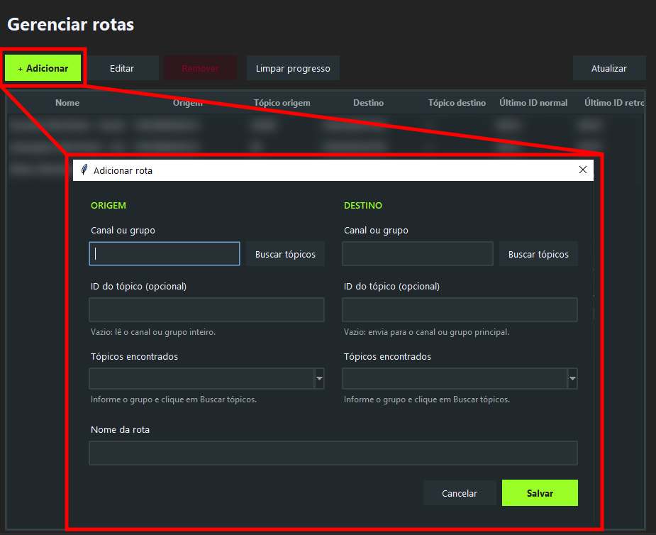

---

## 8. Encontrando o ID de um tópico automaticamente

O botão **Buscar tópicos** está disponível nos dois lados da rota. Ele pode localizar tanto o tópico de origem quanto o tópico de destino.

Para selecionar um tópico:

1. Abra a janela de criação ou edição de rota.
2. Informe o grupo no campo **Canal ou grupo** do lado desejado.
3. Clique em **Buscar tópicos**.
4. Aguarde a consulta ao Telegram.
5. Abra a lista **Tópicos encontrados**.
6. Selecione a opção desejada, exibida como `ID — nome do tópico`.

O campo **ID do tópico** correspondente será preenchido automaticamente.

Repita o processo no outro lado quando quiser criar uma rota de tópico para tópico. Se o grupo informado não tiver tópicos ativados, o programa avisará que ele não é um fórum. O preenchimento manual do ID continua disponível.

> Para buscar tópicos, as credenciais precisam estar salvas e a sessão do Telegram deve estar autenticada.

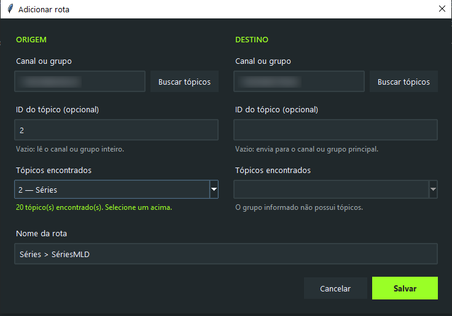

---

## 9. Sincronização normal

O sincronizador normal monitora todas as rotas cadastradas e copia continuamente as mensagens novas.

Para iniciar:

1. Verifique se o Telegram está conectado.
2. Confirme se pelo menos uma rota foi cadastrada.
3. Volte ao **Dashboard**.
4. Clique em **INICIAR SINCRONIZADOR**.

Na primeira execução de cada rota, o programa registra o ID mais recente da origem. As mensagens que já existiam antes desse ponto não são copiadas pelo modo normal. A partir daí, novas mensagens são enviadas ao destino.

Esse comportamento evita que todo o histórico seja duplicado acidentalmente. Para copiar mensagens antigas, use o modo **Retroativo**.

Enquanto estiver ativo, o sincronizador verifica novas mensagens de acordo com o intervalo configurado. Use **PARAR** antes de fechar o programa ou alterar arquivos da pasta.

> O MLDForwarder precisa continuar aberto e o computador precisa permanecer ligado e conectado à internet. Ele não funciona como um serviço hospedado na nuvem.

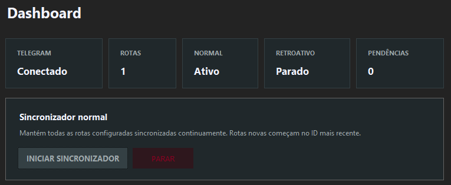

---

## 10. Configurações da sincronização normal

Entre em **Configurações** para ajustar:

### Tamanho do lote

Quantidade máxima de mensagens processadas em cada ciclo.

- Valores maiores ajudam quando há muitas mensagens acumuladas, mas aumentam o uso da API.
- Valores menores reduzem o volume processado em cada ciclo.
- Padrão: **100**.

### Intervalo entre verificações

Tempo de espera, em segundos, antes de procurar novas mensagens novamente.

- Um valor menor sincroniza mais rapidamente e faz mais consultas ao Telegram.
- Um valor maior reduz a frequência das consultas.
- Padrão: **5 segundos**.

Para a maioria dos usuários, os valores padrão são a melhor escolha. Depois de alterar os campos, clique em **SALVAR CONFIGURAÇÕES**.

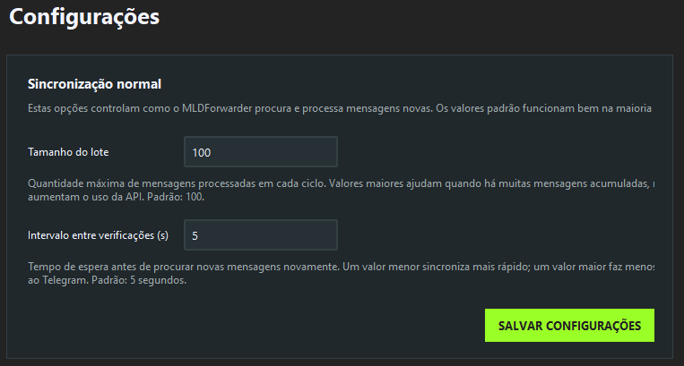

---

## 11. Importando mensagens antigas

O modo **Retroativo** serve para copiar o histórico que existia antes do início da sincronização normal.

1. Pare o sincronizador normal, caso esteja ativo.
2. Entre em **Retroativo**.
3. Escolha uma rota ou selecione **Todas as rotas**.
4. Revise as opções de importação.
5. Clique em **INICIAR RETROATIVO**.

O progresso é salvo automaticamente. Se o processo for interrompido, ele poderá continuar do ponto registrado na próxima execução.

Os modos normal e retroativo não funcionam simultaneamente. Isso evita conflitos entre os dois processos.

### Limite — 0 significa todo o histórico

Quantidade máxima de mensagens antigas importadas por rota.

- `1000` importa até mil mensagens;
- `5000` importa até cinco mil;
- `0` importa todo o histórico disponível.

Padrão: **1000**.

### Começar pelo ID

Ignora mensagens com ID menor ou igual ao valor informado.

- Use `0` para começar pela mensagem mais antiga disponível.
- Use um ID específico quando quiser iniciar a importação depois de determinado ponto.

Padrão: **0**.

### Tamanho do lote

Número de mensagens preparado em cada etapa. Um lote maior pode acelerar a importação, mas também aumenta o uso da API.

Padrão: **100**.

### Tentativas em caso de erro

Quantidade máxima de tentativas de envio para cada mensagem que apresentar erro. Quando o limite é atingido, a mensagem permanece registrada nas pendências.

Padrão: **3**.

> Ao usar `0` para importar todo o histórico, o tempo total dependerá da quantidade de mensagens, do tamanho das mídias e dos limites aplicados pelo Telegram.

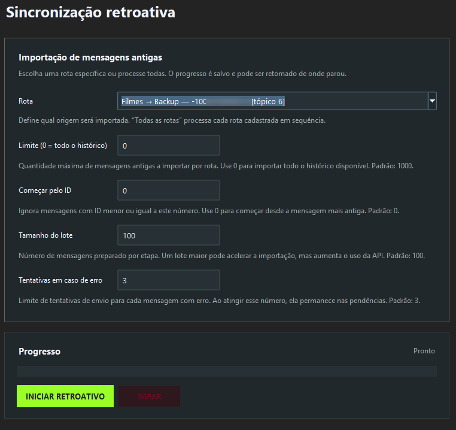

---

## 12. Acompanhando rotas, progresso e pendências

A tabela da página **Rotas** mostra:

- nome da rota;
- origem;
- tópico de origem;
- destino;
- tópico de destino;
- último ID do modo normal;
- último ID do retroativo;
- número de pendências.

Use **Atualizar** para recarregar os dados exibidos.

### Editar

Altera a origem, o tópico de origem, o destino, o tópico de destino ou o nome da rota. Ao mudar a identificação da rota, o programa remove o progresso associado à configuração anterior para evitar inconsistências.

### Remover

Exclui a rota da configuração. O programa também perguntará se você deseja remover os registros de progresso dela. Nenhuma mensagem já enviada será apagada do Telegram.

### Limpar progresso

Apaga o ponto salvo da rota selecionada.

- No modo normal, a rota será reinicializada no ID mais recente e o histórico existente não será reenviado.
- No retroativo, a rota voltará ao ID inicial configurado.

Use essa opção com atenção.

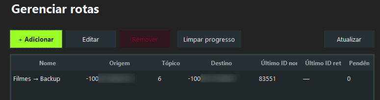

---

## 13. Entendendo o Log

A página **Log** mostra as atividades da sessão atual do programa. Consulte-a quando quiser:

- confirmar que uma mensagem foi processada;
- verificar a inicialização de uma rota;
- acompanhar a importação retroativa;
- identificar um erro de permissão ou conexão;
- saber se o Telegram solicitou uma pausa temporária.

O botão **Limpar log** remove apenas o texto exibido na tela. Ele não apaga mensagens, rotas ou arquivos de progresso.

Quando o Telegram aplica um `FloodWait`, o motor aguarda o período solicitado e tenta continuar. Evite reduzir demais o intervalo ou usar lotes exageradamente grandes.

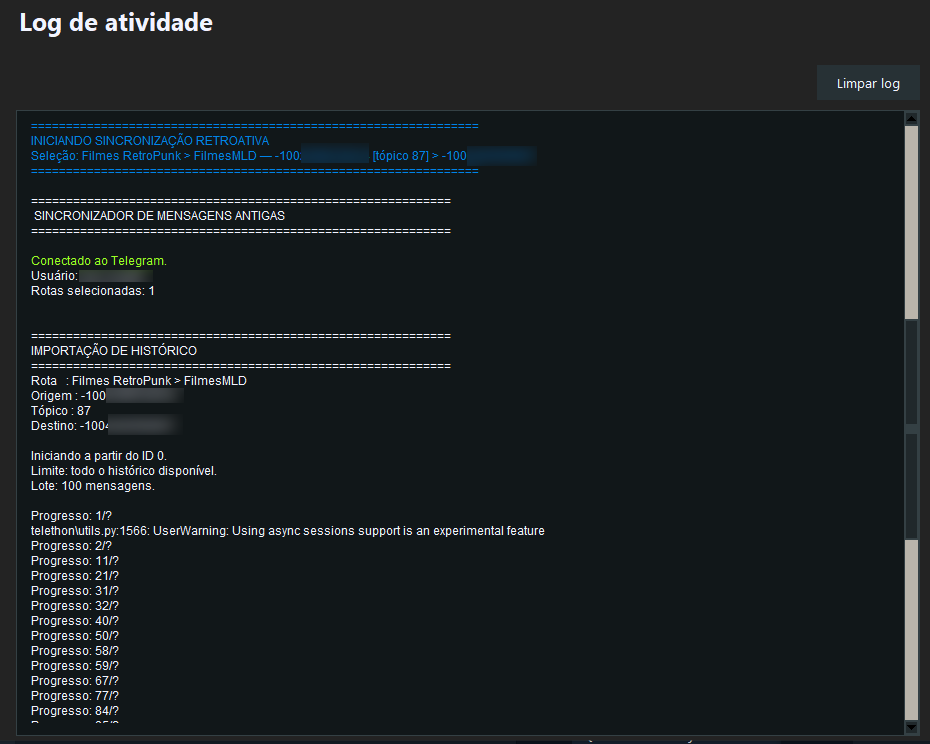

---

## 14. Arquivos importantes e segurança

O MLDForwarder usa arquivos locais para manter credenciais, rotas e progresso:

- `.env` — API ID e API Hash;
- `user_session.session` — sessão autenticada do Telegram;
- `channels.json` — rotas cadastradas;
- `sync_progress.json` — progresso da sincronização normal;
- `historico_progress.json` — progresso e pendências do retroativo;
- `normal_config.json` — opções do modo normal;
- `retro_config.json` — opções do retroativo;
- `app_config.json` — preferências gerais.

Não compartilhe `.env` nem `user_session.session`. Quem tiver acesso válido ao arquivo de sessão poderá tentar usar a conta conectada.

Na versão portátil, esses arquivos ficam junto da pasta do programa. Se você mover a pasta para outro computador ou dispositivo USB, trate-a como informação privada.

Para criar um backup da configuração, feche o MLDForwarder e copie a pasta inteira para um local seguro.

---

## 15. Solução de problemas

### O Windows bloqueou a abertura

A versão atual não possui assinatura digital. Se o arquivo foi obtido da fonte oficial, abra **Mais informações** e escolha **Executar assim mesmo**.

### O código de autenticação não chegou por SMS

O portal e o login da API normalmente enviam o código pelo próprio Telegram. Verifique a conversa de serviço do Telegram nos aplicativos já conectados.

### O programa pede uma senha 2FA

Sua conta usa verificação em duas etapas. Digite a senha criada nas configurações de segurança do Telegram — não o código recebido na conversa.

### A busca de tópicos não funciona

Confirme se:

- API ID e API Hash foram salvos;
- a sessão está autenticada;
- o grupo informado está acessível pela conta;
- o grupo possui tópicos ativados;
- o ID ou `@username` do grupo está correto;
- você clicou em **Buscar tópicos** no lado correto da rota.

### A mensagem não chegou ao destino

Verifique o **Log** e confirme se a conta tem permissão para publicar no destino. Confira também os IDs da origem, do tópico de origem, do destino e do tópico de destino.

### Mensagens antigas não foram copiadas pelo modo normal

Isso é esperado. Rotas novas começam no ID mais recente para evitar duplicação. Use **Retroativo** para importar o histórico.

### O retroativo parou antes de terminar

Inicie o modo novamente. O programa usa o progresso salvo para continuar. Mensagens que atingirem o limite de tentativas permanecerão nas pendências.

### O sincronizador normal não inicia

Confira se:

- as credenciais foram salvas;
- a conta está autenticada;
- existe pelo menos uma rota;
- o retroativo está parado;
- os três executáveis da versão portátil continuam na mesma pasta.

### Posso fechar a interface depois de iniciar?

Não. O MLDForwarder precisa permanecer aberto. Se houver um processo em andamento, a interface perguntará se deseja solicitar a parada antes de fechar.

---

## 16. Perguntas frequentes

### As mensagens aparecem como encaminhadas?

Não. O conteúdo é reenviado como uma nova mensagem, sem assinatura de encaminhamento.

### A formatação original dos textos é preservada?

Sim. O MLDForwarder 2.8.0 preserva as formatações compatíveis de textos e legendas, como negrito, itálico, sublinhado, tachado, spoiler, código, links, menções, citações e emojis personalizados compatíveis. Em álbuns, cada legenda mantém sua própria formatação.

### Posso sincronizar vários canais?

Sim. Cadastre quantas rotas forem necessárias, considerando os limites e permissões da sua conta no Telegram.

### Posso sincronizar vários tópicos do mesmo grupo?

Sim. Crie uma rota separada para cada tópico. Cada uma terá progresso próprio.

### Posso enviar as mensagens diretamente para um tópico?

Sim. Informe o grupo no lado **DESTINO** e selecione o tópico desejado. Se o campo **ID do tópico** do destino ficar vazio, a mensagem será enviada ao canal, grupo ou tópico principal.

### Posso criar uma rota de tópico para tópico?

Sim. Selecione um tópico no lado **ORIGEM** e outro no lado **DESTINO**. O MLDForwarder também aceita rotas de canal ou grupo para tópico.

### Posso sincronizar o grupo inteiro?

Sim. Deixe o campo **ID do tópico** da origem vazio. Para enviar ao grupo principal, deixe também vazio o tópico do destino.

### O programa copia todo o histórico automaticamente?

Não. O modo normal copia mensagens novas. O histórico só é importado quando você inicia o modo retroativo.

### Edições e exclusões também são espelhadas?

Não. O MLDForwarder trabalha com o envio de mensagens como novas publicações. Alterações ou exclusões feitas posteriormente na origem não modificam automaticamente a cópia já enviada.

### Preciso deixar o computador ligado?

Sim. A sincronização acontece localmente no seu computador.

### Preciso instalar Python?

Não. Os executáveis já incluem os componentes necessários.

### Posso usar a mesma configuração depois de atualizar?

Sim. A versão 2.8.0 mantém compatibilidade com as rotas, a sessão e os arquivos de progresso das versões recentes anteriores do projeto, incluindo rotas antigas sem tópico de destino.

---

## Comece com uma rota de teste

Antes de configurar canais importantes, crie uma origem e um destino de teste. Envie uma mensagem de texto, uma foto com legenda e um pequeno álbum. Verifique o resultado e consulte o Log.

Depois do teste, você já pode cadastrar as rotas definitivas e manter o MLDForwarder trabalhando no Dashboard.

**MLDForwarder 2.8.0 — sincronização organizada, histórico preservado e controle em uma única interface.**

---

## Download e atualizações

Consulte a página de [Releases](../../../releases/latest) para baixar a versão mais recente e conferir as notas de atualização.
